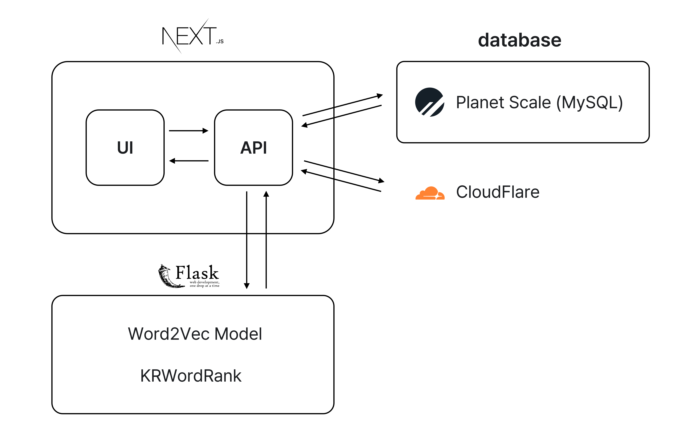

<div align="center">
<div align="center">

</div>
<div>
<a href=""></a>
</div>
</div>

<br/>

개인차원에서 건강관리를 목적으로 몸상태를 다이어리처럼 매일 기록하고 관리할 수 있는 서비스가 있었으면 좋겠다는 생각에서 시작한 프로젝트입니다.

<br/>

## 나만의 건강비서, 토리를 만나보세요!

바디토리는 나의 몸 건강상태를 간편하게 기록하고  
기록된 증상을 기반으로 병원과 진료과목을 추천해주는 건강관리 서비스입니다.  
병원과의 연계를 통해 손쉬운 기록 공유 및 진료내역 관리도 가능합니다.

:microphone: 음성으로 매일 간편하게 건강상태를 기록해요.

:hospital: 건강상태를 기반으로 어떤 진료과에 가야하는지 알려드릴게요.

:clipboard: 나의 병원을 등록하면 병원에 나의 증상기록을 공유해 진료에 도움을 받을 수 있어요.

<br/>

##  [바디토리 서비스 이용해보기](https://bodytory-ruddy.vercel.app/)

<br/>

:point_down: **바디토리에 대한 자세한 프로젝트 내용이 궁금하다면 아래 Notion을 방문해보세요!**  
<a href="https://hihisohi.notion.site/ae3227136623441e94dc33b713bced5c">바디토리 자세히 알아보기</a>

<br/>
<br/>

## 기술 스택

<div>
  
  
  
  
  
  
  
  
  
</div>

<br/>
<br/>

## 아키텍처



<br/>
<br/>

## 설치 방법

```bash
cd next
npm install
```

### 개발 모드 실행

```bash
npm run dev
```

<br/>
<br/>

## 기능 설명

### :microphone: 오늘 기록하기

- ETRI에서 제공하는 한국어 음성인식 API를 활용하여 **음성으로 간편하게 증상을 기록**할 수 있어요!
- 신체 부위를 선택해 **부위별 증상을 기록**할 수 있어요!
- 증상에 대한 **사진 업로드**를 통해 내 증상에 대한 상세한 기록을 남길 수 있어요!
- 만약 잘못 기록했거나 내용을 추가하고 싶다면 **기록의 수정/삭제**가 가능해요!

### :clipboard: 기록 확인하기

`대시보드`

- 대시보드를 통해 **최근 나의 건강상태 분석결과를 확인**할 수 있어요!
- 딥러닝 모델을 통해 **기록된 증상을 기반으로 나에게 적합한 진료과목을 추천**받을 수 있어요!
- 추천받은 진료과목이 있는 **내 주변 병원을 지도에서 확인**할 수 있어요!

`타임라인`

- 신체부위 별로 내가 **기록한 증상과 병원 기록을 확인**할수 있어요!
- 기록에서 **자주 발생하는 키워드**를 확인하고 **키워드로 필터링**할 수 있어요!
- 각 기록은 **사진 추가, 수정, 삭제**가 가능해요!

### :hospital: 내 병원 관리하기

- 내 병원으로 등록한 병원의 목록을 확인하고 수정할 수 있어요!
- **키워드를 검색**하거나 **내 주변 지도**에서 병원을 찾아 **내 병원으로 추가**할 수 있어요!
- 각 병원별로 **나의 증상기록을 공유 여부를 설정**할 수 있어요!
- 내 병원으로 등록된 병원에서 진료를 받은 적이 있다면 **진료내역을 확인 가능**해요!

<br/>
<br/>

## Team

<table>
  <tr>
    <td align="center">
      <a href="https://github.com/chspower1"><b>조호성</b></a>
    </td>
    <td>
      
      
      
    </td>
  </tr>
  <tr>
    <td align="center">
      <a href="https://github.com/hihisohi"><b>정소희</b></a>
    </td>
     <td>
      
      
      
      
    </td>
  </tr>
  <tr>
    <td align="center">
      <a href="https://github.com/KimKW1007"><b>김경원</b></a>
    </td>
    <td>
      
      
    </td>
  </tr>
  <tr>
    <td align="center">
      <a href="https://github.com/Ryong-E"><b>한동룡</b></a>
    </td>
    <td>
      
      
    </td>
  </tr>
  <tr>    
    <td align="center">
      <a href="https://github.com/Peelsob4d"><b>오다현</b></a>
    </td>
    <td>   
      
      
      
    </td>
  </tr>
</table>

<br/>
<br/>

<div align="center">

</div>
